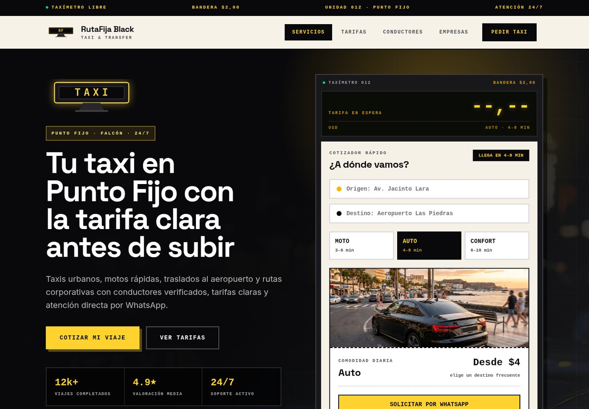

# RutaFija Black

[Español](README.md) · [English](README.en.md)

Sitio web de demostración, de una sola página: servicio de taxi y transfer premium con cotizador, tarifas, conductores y reservas por WhatsApp.

**Demo en vivo:** https://agencia-web-taxi-demo.vercel.app

<a href="https://agencia-web-taxi-demo.vercel.app"></a>

> Es una plantilla de demostración de [Carlos Avila](https://github.com/AvilaCarlosDev): el negocio, los precios y las cifras son de ejemplo. Sirve como base para el sitio web de un negocio real.

## Qué incluye

- Diseño responsivo (móvil, tableta y escritorio) hecho con React y Tailwind.
- Menú por secciones que también funciona en el teléfono, con la sección visible resaltada.
- Cotizador que calcula la tarifa de Moto, Auto o Confort según el destino y envía el viaje por WhatsApp.
- SEO completo: `canonical`, Open Graph y Twitter con imagen propia, JSON-LD, `robots.txt`, `sitemap.xml`, manifest, iconos y página 404.
- Seguridad: cabeceras HTTP y política CSP estricta en `vercel.json`, `security.txt` y cero recursos de terceros (las tipografías van autoalojadas con Fontsource).
- Privacidad: sin cookies ni analítica; lo que se escribe en los campos no sale del navegador salvo en el mensaje de WhatsApp; página de [política de privacidad](public/privacidad/index.html) enlazada desde el pie.
- Imágenes alojadas dentro del proyecto (`public/img`): el sitio no depende de servicios externos para mostrarse.

## Tecnología

React 19 · Vite 8 · Tailwind CSS 4 · Vitest + Testing Library · ESLint · Vercel

## Cómo usarlo

Requisitos: Node.js 22 o superior.

```bash
npm ci          # instala dependencias
npm run dev     # servidor de desarrollo
npm run lint    # revisión de código
npm test        # pruebas
npm run build   # build de producción en dist/
```

## Pruebas

- `src/App.test.jsx` protege la calidad del contenido: se renderiza sin errores, no hay imágenes externas, todas existen y tienen texto alternativo, las anclas apuntan a secciones reales, los enlaces externos usan `rel="noopener"` y no hay botones vacíos.
- `src/estandar.test.jsx` protege el estándar de SEO y seguridad: canonical y Open Graph absolutos, imagen social con medidas, JSON-LD válido, `robots.txt`, `sitemap.xml`, manifest e iconos existentes, `security.txt` vigente, 404 sin indexar, CSP sin `unsafe-eval`, sin recursos de terceros, un único `h1`, copyright con enlace a privacidad y ausencia de voseo (español venezolano, tuteo).

## Integración continua

`.github/workflows/ci.yml` ejecuta lint, pruebas, build y auditoría de dependencias en cada push a `main` y en cada pull request.

## Despliegue

El proyecto se despliega en Vercel (`vercel.json`). Cada cambio en `main` publica una nueva versión.

## Imágenes

- Fotos de ambiente descargadas de [Unsplash](https://unsplash.com/license) y alojadas en `public/img/foto-*.jpg`.
- Imágenes generadas con IA: `sedan.jpg`.
- `public/og.jpg` es la imagen de vista previa al compartir (1200×630).

## Contribuir y seguridad

Lee [CONTRIBUTING.md](CONTRIBUTING.md), el [código de conducta](CODE_OF_CONDUCT.md) y la [política de seguridad](SECURITY.md). Licencia [MIT](LICENSE).

## Autor

Carlos Avila · [GitHub](https://github.com/AvilaCarlosDev) · [LinkedIn](https://www.linkedin.com/in/avilacarlosdev)
